# Plateforme de Partage de Plats Faits Maison - Architecture Fullstack

> **Document Status:** ✅ VALIDÉ  
> **Version:** 1.0  
> **Date:** 15 janvier 2026  
> **Auteur:** Winston (Architect Agent)  
> **Validation:** Checklist Architect 100% passée

---

## Introduction

Ce document définit l'architecture fullstack complète pour la Plateforme de Partage de Plats Faits Maison, incluant les systèmes backend, l'implémentation frontend, et leur intégration. Il sert de source unique de vérité pour le développement assisté par IA, assurant la cohérence sur l'ensemble de la stack technologique.

Cette approche unifiée combine ce qui serait traditionnellement des documents d'architecture backend et frontend séparés, rationalisant le processus de développement pour les applications fullstack modernes où ces préoccupations sont de plus en plus entrelacées.

### Starter Template / Projet Existant

**Décision:** Projet greenfield - Scaffolding personnalisé selon les spécifications du PRD

Le PRD définit déjà une structure monorepo avec pnpm workspaces conforme aux meilleures pratiques. Aucun starter template externe n'est requis, mais la structure s'inspire des patterns établis (T3 Stack pour le typage, Turborepo pour l'organisation).

### Change Log

| Date | Version | Description | Author |
|------|---------|-------------|--------|
| 2026-01-15 | 1.0 | Création initiale du document d'architecture | Winston (Architect) |
| 2026-01-15 | 1.1 | Ajout détails API 42, versions exactes, accessibilité WCAG | Winston (Architect) |
| 2026-01-15 | 1.2 | Ajout GDPR, fallback strategies, validation finale | Winston (Architect) |

---

## High Level Architecture

### Technical Summary

La plateforme est une **application fullstack monolithique** déployée sur une infrastructure serverless moderne. Elle utilise Next.js pour le frontend avec rendu hybride (SSG/SSR), Express.js pour une API REST stateless, et PostgreSQL pour la persistance des données transactionnelles critiques (tokens).

L'architecture suit un pattern **Jamstack modernisé** avec:
- Frontend statique déployé sur CDN (Vercel Edge)
- API backend serverless-ready (Railway/Render)
- Base de données managée avec ACID compliance (Supabase/Neon)
- Authentification déléguée (OAuth 42) avec JWT pour les sessions

Cette architecture atteint les objectifs du PRD: simplicité de déploiement free-tier, performance (<2s page load), et scalabilité jusqu'à 200 utilisateurs concurrents.

### Platform and Infrastructure Choice

**Platform:** Vercel (Frontend) + Railway (Backend) + Supabase (Database)

**Key Services:**
- Vercel: Hosting Next.js, Edge Network, Preview Deployments
- Railway: Express.js API hosting, Auto-deploy, Logging
- Supabase: PostgreSQL 15, Connection pooling, Auto backups
- Cloudinary: Image CDN, Transformations, Storage
- Resend: Transactional emails

**Deployment Regions:** Europe (eu-west) - Optimisé pour École 42 Paris

### Repository Structure

**Structure:** Monorepo avec pnpm workspaces

**Monorepo Tool:** pnpm workspaces (Turborepo optionnel pour caching)

**Package Organization:**
```
/
├── apps/
│   ├── web/          # Next.js 14 App Router
│   └── api/          # Express.js + TypeScript
├── packages/
│   ├── shared/       # Types, validation schemas (Zod)
│   └── database/     # Prisma schema, migrations
├── .github/
│   └── workflows/    # CI/CD GitHub Actions
├── package.json      # pnpm workspace config
└── README.md
```

### High Level Architecture Diagram

```mermaid
graph TB
    subgraph "Client Layer"
        U[👤 Utilisateur 42]
        MB[📱 Mobile Browser]
        DB[💻 Desktop Browser]
    end
    
    subgraph "Edge/CDN - Vercel"
        VE[Vercel Edge Network]
        NX[Next.js App<br/>SSR + Static]
    end
    
    subgraph "API Layer - Railway"
        API[Express.js API<br/>REST + JWT Auth]
        PM[Passport.js<br/>OAuth 42]
    end
    
    subgraph "External Services"
        O42[École 42 OAuth API]
        CLD[Cloudinary<br/>Image CDN]
        RSN[Resend<br/>Email Service]
    end
    
    subgraph "Data Layer - Supabase"
        PG[(PostgreSQL<br/>Users, Meals, Tokens)]
    end
    
    U --> MB & DB
    MB & DB --> VE
    VE --> NX
    NX <--> API
    API <--> PM
    PM <--> O42
    API <--> PG
    API --> CLD
    API --> RSN
    NX --> CLD
```



### Architectural Patterns

- **Monorepo avec Workspaces:** Code frontend/backend dans un seul repo avec packages partagés - _Rationale:_ Partage de types TypeScript, déploiement atomique, simplicité MVP
- **API REST Stateless:** Endpoints RESTful avec JWT, pas de sessions serveur - _Rationale:_ Scalabilité horizontale, compatible free-tier
- **Repository Pattern:** Couche d'abstraction Prisma pour accès données - _Rationale:_ Testabilité, migration DB future possible
- **Server-Side Rendering Hybride:** Next.js App Router avec RSC + client components - _Rationale:_ SEO, performance initiale, interactivité
- **Token-based Authentication:** JWT httpOnly cookies après OAuth 42 - _Rationale:_ Sécurité, stateless, compatible CORS
- **Escrow Pattern:** Tokens bloqués jusqu'à confirmation bilatérale - _Rationale:_ Confiance transactionnelle, protection acheteur/vendeur
- **Optimistic UI Updates:** Frontend met à jour avant confirmation API - _Rationale:_ UX fluide, perception de rapidité

---

## Tech Stack

Cette table est la **source unique de vérité** pour toutes les technologies du projet. Tout développement doit utiliser ces versions exactes.

| Category | Technology | Version | Purpose | Rationale |
|----------|------------|---------|---------|-----------|
| Frontend Language | TypeScript | 5.3.3 | Type safety across codebase | Strict mode, catch errors at compile time |
| Frontend Framework | Next.js | 14.2.0 | React framework with App Router | SSR/SSG, file-based routing, Vercel optimized |
| UI Component Library | shadcn/ui | 0.8.0 | Pre-built accessible components | Customizable, Tailwind-based, copy-paste pattern |
| State Management | TanStack Query + React Context | 5.28.0 | Server state + global client state | Caching, deduplication, auth context |
| CSS Framework | Tailwind CSS | 3.4.1 | Utility-first styling | Rapid development, consistent design system |
| Form Handling | React Hook Form + Zod | 7.50.0 + 3.22.4 | Form state + validation | Performance, type-safe schemas shared with backend |
| Backend Language | TypeScript | 5.3.3 | Type safety for API | Types shared with frontend via monorepo |
| Backend Framework | Express.js | 4.18.2 | REST API server | Lightweight, mature, excellent middleware ecosystem |
| API Style | REST | OpenAPI 3.0 | Resource-based endpoints | Simple, well-understood, easy to document |
| ORM | Prisma | 5.10.0 | Type-safe database access | Auto-generated types, migrations, excellent DX |
| Database | PostgreSQL | 15.0 | Primary data store | ACID compliance critical for token transactions |
| Cache | In-memory (Node.js) | - | Rate limiting, session cache | Sufficient for MVP <200 users |
| File Storage | Cloudinary | - | Image upload and CDN | Free tier 25GB, auto-optimization, WebP |
| Authentication | Passport.js + JWT | 0.7.0 + 9.0.2 | OAuth 42 + session tokens | Mature OAuth library, httpOnly cookies |
| Email Service | Resend | 3.2.0 | Transactional emails | Developer-friendly, generous free tier |
| Frontend Testing | Jest + React Testing Library | 29.7.0 + 14.2.0 | Unit + component tests | Standard React testing stack |
| Backend Testing | Jest + Supertest | 29.7.0 + 6.3.4 | Unit + API integration tests | Fast, good Express support |
| E2E Testing | Manual (Phase 1) | - | User journey validation | Playwright deferred to Phase 2 |
| Build Tool | Turbo | 1.12.0 | Monorepo task runner | Caching, parallel builds |
| Bundler | Next.js built-in | - | Frontend bundling | Zero-config with Next.js |
| CI/CD | GitHub Actions | - | Automated testing and deploy | Free for public repos |
| Monitoring | Sentry | 7.100.0 | Error tracking | Free tier 5K events/month |
| Logging | Platform native + Winston | 3.11.0 | Request/error logging | Railway/Render built-in logs |

---

## Data Models

### User

**Purpose:** Représente un étudiant 42 authentifié, avec ses préférences et son solde de tokens.

**Key Attributes:**
- `id`: string (UUID) - Identifiant unique
- `fortytwoId`: string - ID de l'API 42 OAuth
- `email`: string - Email 42
- `name`: string - Nom complet
- `avatarUrl`: string | null - Photo de profil depuis 42
- `bio`: string | null - Biographie (max 300 chars)
- `tokens`: integer - Solde de tokens (défaut: 100)
- `preferredCuisines`: string[] - Cuisines préférées
- `dietaryPreferences`: string[] - Préférences alimentaires
- `safetyOnboardingCompletedAt`: datetime | null - Date de complétion onboarding
- `emailNotifications`: boolean - Préférences email (défaut: true)
- `createdAt`: datetime - Date inscription
- `updatedAt`: datetime - Dernière mise à jour

#### TypeScript Interface

```typescript
interface User {
  id: string;
  fortytwoId: string;
  email: string;
  name: string;
  avatarUrl: string | null;
  bio: string | null;
  tokens: number;
  preferredCuisines: string[];
  dietaryPreferences: string[];
  safetyOnboardingCompletedAt: Date | null;
  emailNotifications: boolean;
  createdAt: Date;
  updatedAt: Date;
}
```

#### Relationships
- Has many `Meal` (meals posted by user)
- Has many `Reservation` as reserver
- Has many `TokenTransaction`

---

### Meal

**Purpose:** Représente un plat fait maison posté pour échange.

**Key Attributes:**
- `id`: string (UUID) - Identifiant unique
- `userId`: string (FK) - Référence au cook
- `title`: string - Nom du plat
- `description`: string - Description détaillée
- `portions`: integer - Nombre de portions (1-10)
- `cuisineType`: string - Type de cuisine
- `dietaryTags`: string[] - Tags (vegetarian, vegan, etc.)
- `allergens`: string[] - Allergènes présents
- `tokenCost`: integer - Coût en tokens
- `preparedDate`: datetime - Date de préparation
- `expirationDate`: datetime - Date d'expiration
- `pickupLocation`: string - Emplacement frigo
- `fridgeNumber`: string - Numéro du frigo
- `pickupInstructions`: string | null - Instructions supplémentaires
- `status`: enum - 'available' | 'reserved' | 'completed' | 'expired'
- `createdAt`: datetime
- `updatedAt`: datetime

#### TypeScript Interface

```typescript
interface Meal {
  id: string;
  userId: string;
  title: string;
  description: string;
  portions: number;
  cuisineType: string;
  dietaryTags: string[];
  allergens: string[];
  tokenCost: number;
  preparedDate: Date;
  expirationDate: Date;
  pickupLocation: string;
  fridgeNumber: string;
  pickupInstructions: string | null;
  status: 'available' | 'reserved' | 'completed' | 'expired';
  createdAt: Date;
  updatedAt: Date;
}
```

#### Relationships
- Belongs to `User` (cook)
- Has many `MealImage`
- Has many `Reservation`

---

### MealImage

**Purpose:** Stocke les photos associées à un plat (1-3 images par plat).

#### TypeScript Interface

```typescript
interface MealImage {
  id: string;
  mealId: string;
  imageUrl: string;
  displayOrder: number;
  uploadedAt: Date;
}
```

---

### Reservation

**Purpose:** Représente une réservation de plat avec système d'escrow.

#### TypeScript Interface

```typescript
interface Reservation {
  id: string;
  mealId: string;
  reserverId: string;
  tokensAmount: number;
  status: 'pending' | 'confirmed' | 'completed' | 'cancelled' | 'expired' | 'disputed';
  pickupPhotoUrl: string | null;
  pickupConfirmedAt: Date | null;
  completedAt: Date | null;
  createdAt: Date;
}
```

#### Relationships
- Belongs to `Meal`
- Belongs to `User` (reserver)
- Has many `TokenTransaction`
- May have one `Dispute`

---

### TokenTransaction

**Purpose:** Audit trail de toutes les opérations de tokens pour transparence et debugging.

#### TypeScript Interface

```typescript
interface TokenTransaction {
  id: string;
  userId: string;
  amount: number;
  type: 'initial_grant' | 'reservation_escrow' | 'reservation_refund' | 'meal_payment' | 'admin_adjustment';
  relatedReservationId: string | null;
  description: string | null;
  createdAt: Date;
}
```

---

### Dispute

**Purpose:** Enregistre les litiges pour review manuel par admin.

#### TypeScript Interface

```typescript
interface Dispute {
  id: string;
  reservationId: string;
  reporterId: string;
  reason: 'not_as_described' | 'not_found' | 'quality_issue' | 'safety_concern' | 'other';
  description: string;
  evidenceUrls: string[];
  status: 'pending' | 'under_review' | 'resolved';
  resolution: string | null;
  createdAt: Date;
  resolvedAt: Date | null;
}
```

---

### BarterProposal

**Purpose:** Gère les propositions d'échange direct (meal-for-meal).

#### TypeScript Interface

```typescript
interface BarterProposal {
  id: string;
  proposedMealId: string;
  requestedMealId: string;
  proposerId: string;
  status: 'pending' | 'accepted' | 'rejected' | 'expired';
  createdAt: Date;
  expiresAt: Date;
}
```

---

### Entity Relationship Diagram


---

## API Specification

**Base URL:** `https://api.january.app/api` (Production) | `http://localhost:3001/api` (Development)

### Authentication Endpoints

| Method | Endpoint | Description | Auth |
|--------|----------|-------------|------|
| GET | `/auth/42` | Initiate OAuth 42 flow | No |
| GET | `/auth/42/callback` | Handle OAuth callback | No |
| GET | `/auth/me` | Get current user | Yes |
| POST | `/auth/logout` | Clear auth cookie | Yes |

### User Endpoints

| Method | Endpoint | Description | Auth |
|--------|----------|-------------|------|
| GET | `/users/me` | Get current user profile | Yes |
| PATCH | `/users/me` | Update profile | Yes |
| GET | `/users/me/balance` | Get token balance | Yes |
| POST | `/users/me/complete-onboarding` | Complete safety onboarding | Yes |
| GET | `/users/me/meals` | Get user's posted meals | Yes |
| GET | `/users/me/reservations` | Get user's reservations | Yes |
| GET | `/users/:id` | Get public profile | Yes |

### Meal Endpoints

| Method | Endpoint | Description | Auth |
|--------|----------|-------------|------|
| GET | `/meals` | List meals (paginated, filterable) | Yes |
| POST | `/meals` | Create meal listing | Yes + Onboarding |
| GET | `/meals/:id` | Get meal details | Yes |
| PATCH | `/meals/:id` | Update meal (owner) | Yes |
| DELETE | `/meals/:id` | Delete meal (owner) | Yes |
| POST | `/meals/:id/reserve` | Reserve meal | Yes + Onboarding |
| POST | `/meals/:id/propose-barter` | Propose trade | Yes |

### Reservation Endpoints

| Method | Endpoint | Description | Auth |
|--------|----------|-------------|------|
| GET | `/reservations/:id` | Get reservation details | Yes (participant) |
| POST | `/reservations/:id/confirm-pickup` | Confirm with photo | Yes (reserver) |
| POST | `/reservations/:id/complete` | Mark complete | Yes (participant) |
| POST | `/reservations/:id/cancel` | Cancel reservation | Yes (reserver) |
| POST | `/reservations/:id/dispute` | Report dispute | Yes (participant) |

### Barter Endpoints

| Method | Endpoint | Description | Auth |
|--------|----------|-------------|------|
| GET | `/barter-proposals` | List pending proposals | Yes |
| POST | `/barter-proposals/:id/accept` | Accept proposal | Yes (recipient) |
| POST | `/barter-proposals/:id/reject` | Reject proposal | Yes (recipient) |

### Upload Endpoints

| Method | Endpoint | Description | Auth |
|--------|----------|-------------|------|
| POST | `/upload/sign` | Get signed Cloudinary URL | Yes |

### Query Parameters for `GET /meals`

| Parameter | Type | Description |
|-----------|------|-------------|
| `cuisineTypes[]` | string[] | Filter by cuisine types |
| `dietaryTags[]` | string[] | Filter by dietary tags |
| `minPortions` | number | Minimum portions |
| `maxPortions` | number | Maximum portions |
| `search` | string | Search in title/description |
| `limit` | number | Results per page (default: 20, max: 100) |
| `offset` | number | Pagination offset |

### Error Response Format

```json
{
  "error": "ERROR_CODE",
  "message": "Human-readable message",
  "details": {},
  "timestamp": "2026-01-15T14:30:00Z",
  "path": "/api/endpoint"
}
```

### Error Codes

| Code | HTTP | Description |
|------|------|-------------|
| `UNAUTHORIZED` | 401 | Not authenticated |
| `FORBIDDEN` | 403 | Not allowed |
| `NOT_FOUND` | 404 | Resource not found |
| `VALIDATION_ERROR` | 400 | Invalid input |
| `INSUFFICIENT_TOKENS` | 400 | Not enough tokens |
| `MEAL_NOT_AVAILABLE` | 400 | Already reserved/expired |
| `ONBOARDING_REQUIRED` | 403 | Safety onboarding needed |
| `RATE_LIMITED` | 429 | Too many requests |

---

## Components

### Frontend Components

#### AuthProvider
**Responsibility:** Gestion de l'état d'authentification global et protection des routes

**Key Interfaces:**
- `useAuth()` hook: returns `{ user, isLoading, isAuthenticated, logout }`
- `<ProtectedRoute>` component: redirects to login if unauthenticated
- `<OnboardingGuard>` component: redirects to onboarding if not completed

**Dependencies:** TanStack Query, React Context, `/auth/me` endpoint

#### MealCatalog
**Responsibility:** Affichage de la grille de plats avec filtrage et pagination

**Key Interfaces:**
- `<MealGrid>`: Responsive grid layout (1-4 columns)
- `<MealCard>`: Card with image, title, tags, price
- `<FilterPanel>`: Filter controls
- `useMeals(filters)` hook: fetches paginated meals

**Dependencies:** `/meals` endpoint, Cloudinary images, shadcn/ui

#### MealForm
**Responsibility:** Création et édition de listings avec upload d'images

**Key Interfaces:**
- `<CreateMealForm>`: Full form with validation
- `<ImageUploader>`: Drag-drop with preview
- `useMealMutation()` hook: create/update meal

**Dependencies:** React Hook Form, Zod, Cloudinary

#### ReservationFlow
**Responsibility:** Flux de réservation, confirmation pickup, et completion

**Key Interfaces:**
- `<ReserveModal>`: Confirmation dialog
- `<PickupInstructions>`: Location and details
- `<PhotoCapture>`: Camera for verification

**Dependencies:** `/reservations` endpoints, Camera API

#### UserDashboard
**Responsibility:** Vue centralisée des listings et réservations

**Key Interfaces:**
- `<MyListings>`: User's posted meals
- `<MyReservations>`: Active reservations
- `<TokenBalance>`: Balance display
- `<TransactionHistory>`: Token audit log

---

### Backend Components

#### AuthModule
**Responsibility:** OAuth 42, JWT generation, session management

**Key Interfaces:**
- OAuth initiation and callback handlers
- `authMiddleware` - JWT validation
- `requireOnboarding` - Onboarding check

**Dependencies:** Passport.js, jsonwebtoken

#### MealService
**Responsibility:** CRUD operations sur les meals

**Key Interfaces:**
- `createMeal(userId, data)`
- `getMeals(filters, pagination)`
- `updateMealStatus(id, status)`

**Dependencies:** Prisma client, Cloudinary

#### TokenService
**Responsibility:** Gestion atomique des tokens et escrow

**Key Interfaces:**
- `getUserBalance(userId)`
- `escrowTokens(userId, amount, reservationId)`
- `releaseEscrow(reservationId, toUserId)`
- `refundEscrow(reservationId)`

**Dependencies:** Prisma with `$transaction`

**Critical:** Toutes les opérations utilisent des transactions DB atomiques (NFR7)

#### ReservationService
**Responsibility:** Lifecycle complet des réservations

**Key Interfaces:**
- `createReservation(mealId, reserverId)`
- `confirmPickup(reservationId, photoUrl)`
- `completeTransaction(reservationId)`
- `cancelReservation(reservationId)`
- `handleExpiredReservations()` - Cron job

**Dependencies:** TokenService, MealService, NotificationService

#### NotificationService
**Responsibility:** Envoi d'emails transactionnels

**Key Interfaces:**
- `sendReservationConfirmed(reservation)`
- `sendPickupReminder(reservation)`
- `sendTransactionComplete(reservation)`

**Dependencies:** Resend SDK, Email templates

#### BarterService
**Responsibility:** Gestion des propositions d'échange direct

**Key Interfaces:**
- `proposeBarterTrade(proposerId, offeredMealId, requestedMealId)`
- `acceptProposal(proposalId)`
- `expireStaleProposals()` - Cron job

**Dependencies:** ReservationService, MealService

---

### Component Diagram


---

## External APIs

### École 42 OAuth API

- **Purpose:** Authentification exclusive des étudiants 42
- **Documentation:** https://api.intra.42.fr/apidoc
- **Base URL:** `https://api.intra.42.fr`
- **Authentication:** OAuth 2.0 Authorization Code Flow

**Rate Limits (Important):**
| Limite | Valeur |
|--------|--------|
| Par seconde | 2 requêtes/sec |
| Par heure | 1200 requêtes/heure |
| Token expiration | 7200 secondes (2h) |

> 💡 Pour augmenter les limites : demander le rôle "Official App" via intrateam@42.fr

**OAuth 2.0 Flow Complet:**


**Key Endpoints Used:**

| Endpoint | Method | Description |
|----------|--------|-------------|
| `/oauth/authorize` | GET | Initiate authorization (redirect user) |
| `/oauth/token` | POST | Exchange code for access token |
| `/v2/me` | GET | Get authenticated user profile |
| `/oauth/token/info` | GET | Validate token (optional) |

**User Data from `/v2/me` Response:**

```typescript
interface FortyTwoUser {
  id: number;              // Unique 42 user ID
  login: string;           // 42 login (e.g., "jdoe")
  email: string;           // 42 email
  first_name: string;
  last_name: string;
  displayname: string;     // Full display name
  image: {
    link: string;          // Profile photo URL
    versions: {
      large: string;
      medium: string;
      small: string;
      micro: string;
    };
  };
  campus: Array<{
    id: number;
    name: string;          // e.g., "Paris", "Lyon"
  }>;
  cursus_users: Array<{
    level: number;         // Current level
    grade: string | null;  // e.g., "Member"
  }>;
  "staff?": boolean;
  "alumni?": boolean;
  "active?": boolean;
}
```

**Fields Mapped to Our User Model:**
| 42 API Field | Our Field | Notes |
|--------------|-----------|-------|
| `id` | `fortyTwoId` | Primary identifier |
| `login` | `login` | Unique username |
| `email` | `email` | Contact email |
| `displayname` | `displayName` | Shown in UI |
| `image.versions.medium` | `avatarUrl` | Profile picture |
| `campus[0].name` | `campus` | Primary campus |

### Cloudinary API

- **Purpose:** Image upload, storage, transformation, CDN delivery
- **Documentation:** https://cloudinary.com/documentation
- **Base URL:** `https://api.cloudinary.com/v1_1/{cloud_name}`
- **Authentication:** Signed uploads (server-side signature)
- **Rate Limits:** Free tier: 25GB storage + 25GB bandwidth/month

**Key Endpoints Used:**
- `POST /image/upload` - Direct browser upload with signature

**Transformations Applied:** `c_limit,w_1200,q_auto:good,f_webp`

### Resend API

- **Purpose:** Transactional email delivery
- **Documentation:** https://resend.com/docs
- **Base URL:** `https://api.resend.com`
- **Authentication:** API Key in Authorization header
- **Rate Limits:** Free tier: 100 emails/day, 3,000/month

**Key Endpoints Used:**
- `POST /emails` - Send transactional email

**Email Templates:**
| Template | Trigger |
|----------|---------|
| `welcome` | User first login |
| `reservation-confirmed` | Meal reserved |
| `pickup-reminder` | 2h after reservation |
| `transaction-complete` | Both confirmed |
| `reservation-cancelled` | Cancellation |
| `dispute-filed` | Dispute created |

### Environment Variables

```env
# 42 OAuth
FT_CLIENT_ID=your_42_client_id
FT_CLIENT_SECRET=your_42_client_secret
FT_CALLBACK_URL=https://api.january.app/api/auth/42/callback

# Cloudinary
CLOUDINARY_CLOUD_NAME=your_cloud_name
CLOUDINARY_API_KEY=your_api_key
CLOUDINARY_API_SECRET=your_api_secret

# Resend
RESEND_API_KEY=re_xxxxx
RESEND_FROM_EMAIL=noreply@january.app
```

---

## Core Workflows

### Workflow 1: Complete Meal Exchange


### Reservation State Machine


### Meal State Machine


---

## Database Schema

### Prisma Schema Overview

```prisma
// Enums
enum MealStatus { available, reserved, completed, expired }
enum ReservationStatus { pending, confirmed, completed, cancelled, expired, disputed }
enum TokenTransactionType { initial_grant, reservation_escrow, reservation_refund, meal_payment, admin_adjustment }
enum DisputeReason { not_as_described, not_found, quality_issue, safety_concern, other }
enum DisputeStatus { pending, under_review, resolved }
enum BarterStatus { pending, accepted, rejected, expired }
```

### Models Summary

| Model | Key Fields | Constraints |
|-------|------------|-------------|
| **User** | fortytwoId, email, name, tokens, safetyOnboardingCompletedAt | tokens >= 0 |
| **Meal** | userId, title, portions, tokenCost, status, expirationDate | portions 1-10, tokenCost >= 0 |
| **MealImage** | mealId, imageUrl, displayOrder | cascade delete |
| **Reservation** | mealId, reserverId, tokensAmount, status | cascade delete |
| **TokenTransaction** | userId, amount, type, relatedReservationId | audit trail |
| **Dispute** | reservationId, reporterId, reason, status | 1:1 with reservation |
| **BarterProposal** | proposedMealId, requestedMealId, proposerId, status | expiresAt 48h |

### Index Strategy

| Table | Indexed Columns | Purpose |
|-------|-----------------|---------|
| users | fortytwoId, email | OAuth lookup, uniqueness |
| meals | userId, status, expirationDate, cuisineType | Queries, filters, cron |
| reservations | mealId, reserverId, status, createdAt | Lookups, expiration |
| token_transactions | userId, createdAt | History queries |
| disputes | status | Admin queue |
| barter_proposals | expiresAt | Expiration cron |

### Key Constraints

```sql
-- Token integrity
ALTER TABLE users ADD CONSTRAINT tokens_non_negative CHECK (tokens >= 0);

-- Meal validation
ALTER TABLE meals ADD CONSTRAINT portions_range CHECK (portions >= 1 AND portions <= 10);
ALTER TABLE meals ADD CONSTRAINT token_cost_non_negative CHECK (token_cost >= 0);
```

### Migration Commands

```bash
npx prisma migrate dev --name init    # Development
npx prisma migrate deploy             # Production
npx prisma generate                   # Regenerate client
```

---

## Frontend Architecture

### Directory Structure

```
apps/web/
├── app/                          # Next.js App Router
│   ├── (auth)/login/page.tsx     # Login page
│   ├── (main)/                   # Authenticated routes
│   │   ├── page.tsx              # Home/catalog
│   │   ├── meals/[id]/page.tsx   # Meal detail
│   │   ├── meals/create/page.tsx # Create listing
│   │   ├── dashboard/page.tsx    # User dashboard
│   │   └── profile/edit/page.tsx # Edit profile
│   ├── onboarding/safety/page.tsx
│   ├── layout.tsx
│   ├── error.tsx
│   └── not-found.tsx
├── components/
│   ├── ui/                       # shadcn/ui components
│   ├── layout/                   # Header, footer, nav
│   ├── meals/                    # Meal-related components
│   ├── reservations/             # Reservation components
│   └── shared/                   # Reusable components
├── hooks/                        # Custom React hooks
├── lib/                          # Utilities, API client
├── providers/                    # Context providers
└── types/                        # TypeScript types
```

### State Management

| Layer | Tool | Purpose |
|-------|------|---------|
| Server State | TanStack Query | API data, caching, mutations |
| Auth State | React Context | User session, permissions |
| UI State | useState | Modals, forms, local state |
| URL State | Next.js router | Filters, pagination |

### Key Hooks

```typescript
// Server state hooks
useMeals(filters)        // Infinite query for meal catalog
useCreateMeal()          // Mutation for creating meals
useReservations()        // User's reservations
useReserve(mealId)       // Reserve meal mutation

// Auth hooks  
useAuth()                // { user, isAuthenticated, logout }
```

### Routing Guards

- `ProtectedRoute` - Redirects to /login if not authenticated
- `OnboardingGuard` - Redirects to /onboarding if safety not completed
- Route groups `(auth)` and `(main)` for different layouts

### Design System

- **Colors:** Terracotta, sage green, cream (warm, appetizing)
- **Typography:** Inter font family
- **Breakpoints:** sm:640px, md:768px, lg:1024px, xl:1280px
- **Components:** shadcn/ui (Button, Card, Dialog, etc.)

### Performance

- Next.js Image with Cloudinary optimization
- Dynamic imports for heavy components
- TanStack Query for caching and deduplication
- Skeleton loading to prevent layout shift

---

## Infrastructure & DevOps

### Deployment Architecture

| Component | Platform | Purpose |
|-----------|----------|---------|
| Frontend | Vercel | Next.js hosting, Edge CDN |
| Backend | Railway | Express API hosting |
| Database | Supabase | PostgreSQL managed |
| Images | Cloudinary | Storage, CDN, transforms |
| Email | Resend | Transactional emails |
| Errors | Sentry | Error tracking |

### Environment Variables

**Backend (Railway):**
- `DATABASE_URL` - Supabase connection string
- `JWT_SECRET` - 256-bit random string
- `FT_CLIENT_ID`, `FT_CLIENT_SECRET`, `FT_CALLBACK_URL` - 42 OAuth
- `CLOUDINARY_*` - Image service credentials
- `RESEND_API_KEY` - Email service
- `CORS_ORIGIN` - Frontend URL

**Frontend (Vercel):**
- `NEXT_PUBLIC_API_URL` - Backend API URL

### CI/CD Pipeline (GitHub Actions)

```yaml
# On push to main:
# 1. Install dependencies (pnpm)
# 2. Lint + Type check
# 3. Run tests
# 4. Deploy frontend to Vercel
# 5. Deploy backend to Railway
```

### Security

- **Helmet.js** - Security headers (CSP, HSTS, etc.)
- **Rate Limiting** - 100 req/min global, 10 req/15min for auth
- **CORS** - Whitelist frontend domain only
- **Input Validation** - Zod schemas on all inputs

### Monitoring

| Tool | Purpose | Free Tier |
|------|---------|-----------|
| Sentry | Error tracking | 5K events/month |
| Railway Logs | Backend logs | Included |
| Vercel Analytics | Frontend metrics | 2.5K events/month |

### Health Check

```
GET /api/health → { status, timestamp, database, version }
```

---

## Accessibility (WCAG 2.1 AA)

Conformément au NFR11 du PRD, l'application doit respecter les standards WCAG 2.1 niveau AA.

### Principes Directeurs

| Principe | Exigence | Implementation |
|----------|----------|----------------|
| Perceptible | Texte alternatif sur toutes les images | `alt` obligatoire, description pour les plats |
| Utilisable | Navigation clavier complète | Focus visible, skip links, ordre logique |
| Compréhensible | Messages d'erreur clairs | Validation inline, suggestions de correction |
| Robuste | Compatible avec les technologies d'assistance | Semantic HTML, ARIA labels |

### Checklist Technique

**Structure HTML:**
- [ ] Landmarks sémantiques (`<header>`, `<main>`, `<nav>`, `<footer>`)
- [ ] Hiérarchie de titres logique (h1 → h2 → h3)
- [ ] Skip link vers le contenu principal
- [ ] Language déclaré (`lang="fr"`)

**Navigation Clavier:**
- [ ] Tous les éléments interactifs focusables
- [ ] Indicateur de focus visible (outline 2px minimum)
- [ ] Ordre de tabulation logique (`tabindex` évité sauf 0 ou -1)
- [ ] Modals avec focus trap et fermeture Escape
- [ ] Menus déroulants navigables aux flèches

**Formulaires:**
- [ ] Labels associés à chaque input (`for`/`id`)
- [ ] Messages d'erreur liés via `aria-describedby`
- [ ] Required fields marqués visuellement ET avec `aria-required`
- [ ] Autocomplétion avec `autocomplete` attributes

**Contrastes & Visuels:**
- [ ] Ratio minimum 4.5:1 pour texte normal
- [ ] Ratio minimum 3:1 pour grands textes (18px+ bold ou 24px+)
- [ ] Informations pas transmises par couleur seule
- [ ] Focus visible sur tous les états

**Images & Media:**
- [ ] `alt` text descriptif sur images de contenu
- [ ] `alt=""` sur images décoratives
- [ ] Pas d'auto-play sur les médias

**ARIA (quand HTML natif insuffisant):**
- [ ] `aria-label` sur boutons icônes
- [ ] `aria-live` pour mises à jour dynamiques (tokens, notifications)
- [ ] `aria-expanded` sur accordéons/menus
- [ ] `role="alert"` sur messages d'erreur

### Outils de Test

| Outil | Purpose | Intégration |
|-------|---------|-------------|
| axe DevTools | Audit automatisé | Extension navigateur |
| WAVE | Analyse visuelle | Extension navigateur |
| Lighthouse | Score accessibilité | Chrome DevTools |
| eslint-plugin-jsx-a11y | Linting React | CI/CD pipeline |
| VoiceOver/NVDA | Test lecteur d'écran | Manuel |

### Composants shadcn/ui

shadcn/ui est construit sur Radix UI, qui est accessible par défaut. Vérifier:
- Dialog: focus trap, Escape close, aria-modal
- DropdownMenu: keyboard navigation, aria-haspopup
- Toast: aria-live polite
- AlertDialog: role="alertdialog"

### Tests Manuels Requis (Avant Release)

1. **Navigation clavier uniquement** - Parcourir tout le site sans souris
2. **Screen reader** - VoiceOver (Mac) ou NVDA (Windows) sur parcours critique
3. **Zoom 200%** - Aucun contenu caché ou chevauchement
4. **Mode contraste élevé** - Windows High Contrast Mode

---

## GDPR & Data Privacy

### Données Personnelles Collectées

| Catégorie | Données | Base Légale | Rétention |
|-----------|---------|-------------|-----------|
| Identification | id 42, login, email, nom | Exécution contrat | Durée du compte |
| Profil | Bio, préférences alimentaires | Consentement | Jusqu'à suppression |
| Transactions | Réservations, tokens | Intérêt légitime | 3 ans (comptabilité) |
| Technique | IP, logs | Intérêt légitime | 90 jours |

### Droits des Utilisateurs (RGPD)

| Droit | Endpoint | Implementation |
|-------|----------|----------------|
| Accès | `GET /api/users/me/data-export` | Export JSON de toutes les données |
| Rectification | `PATCH /api/users/me` | Modification profil |
| Effacement | `DELETE /api/users/me` | Anonymisation + suppression |
| Portabilité | `GET /api/users/me/data-export?format=json` | Export standardisé |
| Opposition | `PATCH /api/users/me/preferences` | Opt-out notifications |

### Processus de Suppression de Compte

```mermaid
sequenceDiagram
    participant U as User
    participant API as Backend
    participant DB as Database
    
    U->>API: DELETE /users/me (+ confirmation)
    API->>DB: Anonymiser user (login → "deleted_xyz")
    API->>DB: Supprimer données personnelles
    API->>DB: Conserver transactions (anonymisées)
    Note over DB: email → null, name → "Utilisateur supprimé"
    API->>U: Confirmation + logout
```



### Consentement

- **Onboarding:** Checkbox explicite pour conditions d'utilisation
- **Cookies:** Aucun cookie tiers, pas de bandeau requis (cookies techniques uniquement)
- **Emails:** Opt-in explicite, unsubscribe link dans chaque email

### Mesures de Sécurité

- Chiffrement en transit (HTTPS/TLS 1.3)
- Mots de passe non stockés (OAuth 42 uniquement)
- JWT httpOnly + secure + sameSite
- Logs anonymisés après 90 jours

---

## External Service Fallbacks

### Stratégies de Résilience

| Service | Impact si indisponible | Stratégie de Fallback |
|---------|------------------------|------------------------|
| **42 OAuth** | Login impossible | Message d'erreur clair, page de statut 42 |
| **Cloudinary** | Images non affichées | Placeholder image locale, retry avec backoff |
| **Resend** | Emails non envoyés | Queue locale + retry, notifications in-app |
| **Supabase/DB** | App non fonctionnelle | Circuit breaker, page maintenance |

### Implementation Détaillée

#### 42 OAuth Fallback
```typescript
// Vérifier statut 42 API avant redirect
async function checkFortyTwoStatus(): Promise<boolean> {
  try {
    const response = await fetch('https://api.intra.42.fr/oauth/token/info', {
      timeout: 5000
    });
    return response.ok;
  } catch {
    return false;
  }
}

// Si indisponible → message utilisateur
if (!await checkFortyTwoStatus()) {
  return res.render('login', { 
    error: 'L\'authentification 42 est temporairement indisponible. Réessayez dans quelques minutes.' 
  });
}
```

#### Cloudinary Fallback
```typescript
const PLACEHOLDER_IMAGE = '/images/meal-placeholder.webp';

function getMealImageUrl(cloudinaryUrl: string | null): string {
  if (!cloudinaryUrl) return PLACEHOLDER_IMAGE;
  
  // Vérifier si Cloudinary accessible (cache 5 min)
  if (!isCloudinaryHealthy()) {
    return PLACEHOLDER_IMAGE;
  }
  
  return cloudinaryUrl;
}

// Côté frontend: onError fallback
 e.target.src = PLACEHOLDER_IMAGE}
  alt={meal.title}
/>
```

#### Resend Email Fallback
```typescript
interface EmailJob {
  to: string;
  template: string;
  data: Record<string, any>;
  attempts: number;
  createdAt: Date;
}

// Queue en mémoire (ou Redis en production)
const emailQueue: EmailJob[] = [];

async function sendEmail(job: EmailJob): Promise<void> {
  try {
    await resend.emails.send({...});
  } catch (error) {
    if (job.attempts < 3) {
      // Retry avec backoff exponentiel
      job.attempts++;
      setTimeout(() => emailQueue.push(job), Math.pow(2, job.attempts) * 1000);
    } else {
      // Fallback: notification in-app
      await createInAppNotification(job.to, job.template, job.data);
      logger.error('Email failed after 3 attempts', { job, error });
    }
  }
}
```

#### Database Circuit Breaker
```typescript
import CircuitBreaker from 'opossum';

const dbCircuitBreaker = new CircuitBreaker(prismaQuery, {
  timeout: 5000,           // 5s timeout
  errorThresholdPercentage: 50,  // 50% failures opens circuit
  resetTimeout: 30000      // Try again after 30s
});

dbCircuitBreaker.on('open', () => {
  logger.error('Database circuit breaker OPEN');
  // Activer page maintenance
});

dbCircuitBreaker.on('close', () => {
  logger.info('Database circuit breaker CLOSED');
});
```

### Health Check Amélioré

```typescript
GET /api/health → {
  status: 'healthy' | 'degraded' | 'unhealthy',
  timestamp: string,
  services: {
    database: { status: 'up' | 'down', latency: number },
    cloudinary: { status: 'up' | 'down' },
    resend: { status: 'up' | 'down' },
    fortyTwoApi: { status: 'up' | 'down' }
  },
  version: string
}
```

---

