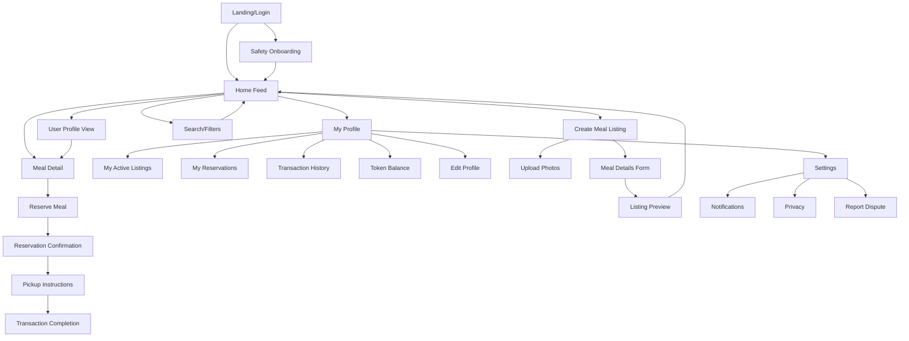
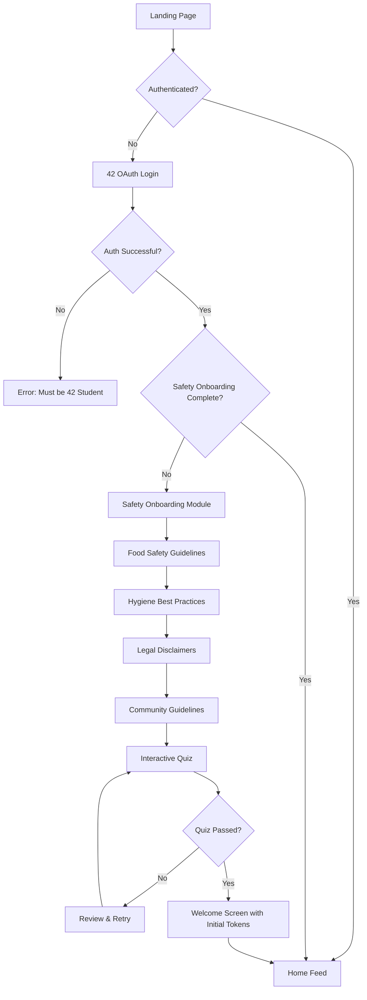
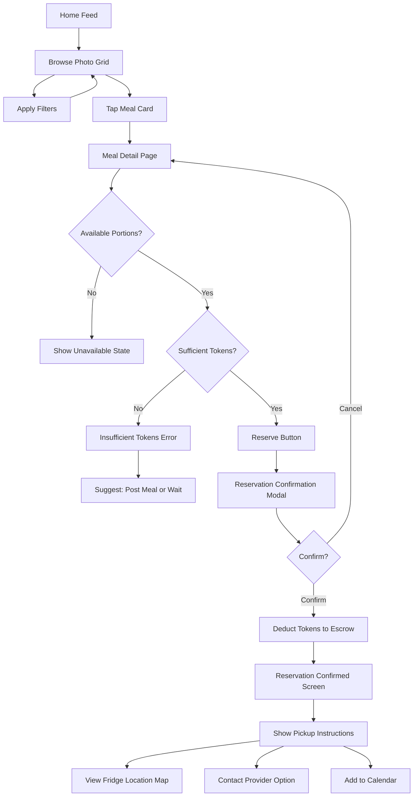
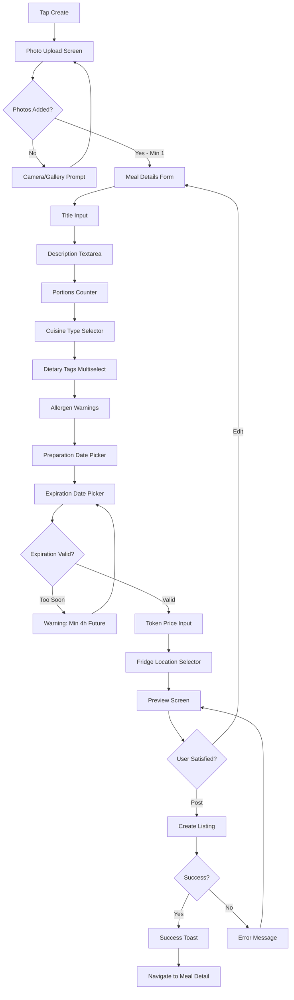

# Plateforme de Partage de Plats Faits Maison UI/UX Specification

---

## Introduction

This document defines the user experience goals, information architecture, user flows, and visual design specifications for Plateforme de Partage de Plats Faits Maison's user interface. It serves as the foundation for visual design and frontend development, ensuring a cohesive and user-centered experience.

### Overall UX Goals & Principles

#### Target User Personas

1. **Le Cuisiner Passionné (The Passionate Cook):** Students who enjoy cooking and take pride in their dishes, seeking validation and connection through food sharing. They want to showcase their culinary skills and discover new recipes.

2. **L'Optimiseur Pragmatique (The Pragmatic Optimizer):** Efficiency-focused students who batch cook to save time/money but crave meal variety. They prioritize quick transactions and clear logistics.

3. **Le Débutant Curieux (The Curious Beginner):** Students new to cooking, looking to learn from others' dishes and gradually build confidence. They need clear guidance and low-pressure first experiences.

#### Usability Goals

- **Instant appetite appeal:** Users should feel hungry and inspired within 5 seconds of browsing
- **2-tap reservations:** Complete a meal reservation in under 10 seconds with maximum 2 interactions
- **Safety confidence:** 100% of new users complete safety onboarding without confusion
- **Social discovery:** Users discover 3+ new community members per week through the platform
- **Effortless returns:** Infrequent users can pick up where they left off without relearning

#### Design Principles

1. **Photo-first storytelling** - Every meal tells a story through images; text supports, never replaces visual appeal
2. **Warm authenticity over polish** - Real photos from real people create trust; avoid overly styled aesthetics
3. **Progressive trust building** - Guide new users gently; unlock advanced features as they gain experience
4. **Invisible safety layer** - Safety is paramount but never obtrusive; work behind the scenes
5. **Community over commerce** - Every interaction reinforces human connection; tokens are means, not the goal

#### Change Log

| Date | Version | Description | Author |
|------|---------|-------------|---------|
| 2026-01-15 | 1.0 | Initial UI/UX specification creation | Sally (UX Expert) |

---

## Information Architecture (IA)

### Site Map / Screen Inventory

### Navigation Structure

**Primary Navigation:** Bottom tab bar (mobile) / Top header (desktop) with 4 main sections:
- **Home** (feed icon): Meal discovery feed with photo-first grid
- **Create** (plus icon): Quick access to create new meal listing
- **Messages** (chat icon): Direct messaging for coordination (future)
- **Profile** (person icon): User profile, token balance, history

**Secondary Navigation:** 
- In-feed filters appear as horizontal scrollable chips at top of Home feed
- Profile section uses vertical list navigation for sub-pages
- Back buttons follow platform conventions (iOS left arrow, Android back button)

**Breadcrumb Strategy:** 
- Minimal breadcrumbs for depth clarity only (e.g., Profile > Transaction History > Transaction Detail)
- Emphasize clear page titles instead of complex breadcrumb trails
- Use visual hierarchy to indicate nesting level

---

## User Flows

### Flow 1: First-Time User Onboarding & Safety Training

**User Goal:** New user wants to join the platform and start browsing/exchanging meals safely

**Entry Points:** 
- Direct link from École 42 internal communications
- Word of mouth referral from existing users
- Discovery through 42 community channels

**Success Criteria:** User completes OAuth authentication and safety onboarding, understands token system, and feels confident about food safety protocols

#### Flow Diagram

#### Edge Cases & Error Handling:
- Non-42 users attempting to register: Show clear error message explaining exclusivity, no account creation
- User abandons onboarding mid-flow: Save progress, send reminder email after 24h
- Failed quiz attempts: Allow unlimited retries but require reviewing failed sections
- Network interruption during onboarding: Auto-save progress at each completed section

**Notes:** The safety onboarding is intentionally sequential and cannot be skipped (FR2). The quiz ensures comprehension rather than just passive reading. Initial token allocation happens at the end to create positive reinforcement.

---

### Flow 2: Browse & Reserve a Meal

**User Goal:** User wants to find an appealing meal and reserve it for pickup

**Entry Points:**
- Landing on Home feed after opening app
- Push notification about new meal matching preferences
- Direct link to specific meal shared by friend

**Success Criteria:** User successfully reserves a meal, tokens are deducted, and pickup instructions are clear

#### Flow Diagram

#### Edge Cases & Error Handling:
- Meal becomes unavailable during viewing: Real-time update showing "Just reserved by someone else"
- Multiple users reserve simultaneously: First commit wins, others see unavailable state
- User lacks exact token amount: Show clear deficit, suggest nearby meals within budget
- Provider cancels after reservation: Instant notification, full token refund, apology message
- User forgets to pick up: Reminder notifications at pickup time, 2 hours before expiry

**Notes:** The 2-tap promise is fulfilled via: Tap meal card → Tap reserve button. The confirmation modal is a safety net to prevent accidental reservations but uses smart defaults (selected portion count, pre-checked terms).

---

### Flow 3: Create & Post a Meal Listing

**User Goal:** User wants to share their home-cooked meal with the community

**Entry Points:**
- Tap Create button from bottom navigation
- Pull-to-refresh gesture on empty "My Listings" page
- Call-to-action when user has high token balance

**Success Criteria:** User successfully posts a complete meal listing with all required information and appealing photos

#### Flow Diagram

#### Edge Cases & Error Handling:
- Photos fail to upload: Show progress indicator, allow retry, suggest reducing size
- User exits mid-creation: Auto-save draft for 24h
- Expiration date too close: Validate minimum 4-hour window for safety
- Duplicate meal detection: "You posted similar meal recently, continue?"
- Invalid allergen info: Require explicit confirmation for common allergens
- Rate limiting hit (10 posts/day): Clear message with countdown timer

**Notes:** Photo-first approach means uploading photos is step 1, immediately setting the visual tone. The form uses smart defaults (expiration = preparation + 3 days, portions = 4, token price = average). Preview screen builds confidence before posting.

---

## Wireframes & Mockups

**Primary Design Files:** 

Figma (recommended - free for students, collaborative, widely adopted in tech communities)

**File Structure:**
- 📱 Mobile Screens (Primary)
- 💻 Desktop Adaptations
- 🎨 Component Library
- 📐 Spacing & Layout System
- 🎭 User Flow Prototypes

**Design File Reference:** [To be created at figma.com]

### Key Screen Layouts

#### Home Feed (Discovery)

**Purpose:** Primary entry point for meal discovery, maximizing visual appeal and encouraging exploration

**Key Elements:**
- Top Bar: Logo, token balance badge (top-right), filter chips (horizontal scroll)
- Meal Grid: 2-column masonry layout on mobile, 3-4 columns on desktop (large food photo with overlay gradient, small avatar + cook name, token price badge, dietary icons)
- Bottom Navigation: Home (active), Create, Messages, Profile icons
- Empty State: Friendly illustration + "No meals yet, be the first to share!"

**Interaction Notes:** Pull-to-refresh, infinite scroll with skeleton loading, filter chips stick when scrolling, tap card for details, long-press for quick preview (future)

**Design File Reference:** [Figma Frame: Mobile/01-Home-Feed]

---

#### Meal Detail Page

**Purpose:** Showcase meal with all information needed to make reservation decision, build trust through photos and provider profile

**Key Elements:**
- Photo Carousel: Full-width, swipeable, dot indicators
- Header Section: Meal title (H1), cook profile (avatar, name, transaction count) - tappable, token price (large, prominent), portions available counter
- Content Sections (collapsible): Description, dietary info (tags + allergen warnings), dates (prepared, expires with countdown), pickup location (fridge name, map thumbnail)
- Action Section: Reserve button (primary, full-width mobile, fixed bottom), share button (secondary), report button (subtle)
- Related Meals: "More from [Cook Name]" carousel

**Interaction Notes:** Hero image pinch-to-zoom, reserve button state changes based on availability/tokens, allergen warnings use high-contrast warning color, expiration countdown real-time, share generates deep link

**Design File Reference:** [Figma Frame: Mobile/02-Meal-Detail]

---

#### Create Meal Listing (Multi-Step Form)

**Purpose:** Guide users through meal posting with clear progress indication, reducing cognitive load by breaking into steps

**Key Elements:**
- Progress Indicator: Step dots or bar (Photos → Details → Preview)
- Step 1 - Photos: Large upload area, thumbnail strip (drag to reorder), "Add photo" button (min 1, max 5)
- Step 2 - Details: Title input (character count), description textarea (emoji support), portions stepper, cuisine type dropdown, dietary tags (multi-select chips), allergen checklist, date pickers, token price input (with suggestion), fridge location selector
- Step 3 - Preview: Meal card as appears in feed, "Looks good?" prompt, edit/post buttons

**Interaction Notes:** Form auto-saves after field blur, inline validation with helpful errors, smart defaults, back button preserves data, preview matches feed appearance exactly

**Design File Reference:** [Figma Frames: Mobile/03a-Create-Photos, 03b-Create-Details, 03c-Create-Preview]

---

#### Reservation Confirmation & Pickup Instructions

**Purpose:** Confirm successful reservation, provide clear pickup instructions, reduce no-shows through reminders

**Key Elements:**
- Success Confirmation: Checkmark animation, "Reserved!" headline, meal thumbnail + title, token transaction summary
- Pickup Instructions Card: Fridge location name (bold), address with "Open in Maps" button, fridge photo, expected availability time, pickup window
- Action Buttons: "Add to Calendar" (primary), "Message [Cook Name]" (secondary), "View My Reservations" (tertiary)
- Important Reminders: Bring container, check meal ID photo, complete transaction after pickup

**Interaction Notes:** Auto-dismiss after 3s to pickup instructions, calendar export includes location/notes, one-tap navigation, push notification scheduled for pickup time

**Design File Reference:** [Figma Frames: Mobile/04a-Reservation-Success, 04b-Pickup-Instructions]

---

#### User Profile

**Purpose:** Display user identity, transaction history, token balance, and settings access

**Key Elements:**
- Profile Header: Avatar (large, circular), name + bio (editable), stats row (meals shared/received, member since), token balance (prominent)
- Navigation Sections: My Active Listings, My Reservations, Transaction History, Settings
- Active Listings Section: Horizontal scrollable meal cards, edit/delete actions, empty state
- Quick Actions: Edit Profile button, Settings gear icon

**Interaction Notes:** Pull-down to refresh, tap stats for detailed breakdown, tap token balance for transaction history, swipe actions on listings

**Design File Reference:** [Figma Frame: Mobile/05-Profile]

---

#### Safety Onboarding Flow

**Purpose:** Educate new users on food safety, set expectations, ensure legal compliance

**Key Elements:**
- Progress Indicator: "Step 2 of 5" or progress bar
- Content Card (per step): Illustration/icon, headline, body text (scannable, bullets), examples/tips
- Navigation: Next/Continue button (bottom), Skip disabled
- Final Quiz: Multiple choice (3-5 questions), immediate feedback, retry option
- Completion: Celebration screen, "You're ready!" + initial token grant, "Start exploring" button

**Interaction Notes:** Swipe gestures to navigate (optional), cannot skip sections, progress persists across sessions, quiz randomizes question order

**Design File Reference:** [Figma Frames: Mobile/06a-Onboarding-Welcome through 06f-Onboarding-Complete]

---

## Component Library / Design System

**Design System Approach:**

**Foundation:** Use **shadcn/ui** (React) or **daisyUI** (Tailwind-based) as the base component library for technical reliability and accessibility, then customize theming to match brand identity.

**Rationale:** Building from scratch is time-consuming for an MVP. These systems provide accessible, tested components while remaining highly customizable. They align with modern web stack preferences and have strong community support.

**Customization Focus:** Warm, appetizing color tones; friendly, readable fonts; generous padding for touch-friendliness; softer corners for warmth; subtle, card-based elevation; smooth, delightful micro-interactions.

### Core Components

#### Button Component

**Purpose:** Primary interaction element for all user actions across the platform

**Variants:** Primary (main actions), Secondary (alternative actions), Tertiary (text-only subtle actions), Danger (destructive actions), Icon-only (square/circular with icon)

**States:** Default, Hover (slightly darker, subtle scale up), Active/Pressed (darker, scale down), Disabled (reduced opacity), Loading (spinner, disabled)

**Usage Guidelines:** Maximum one primary button per screen section; button text uses action verbs; icon buttons include aria-labels; minimum touch target 44x44px on mobile; loading state shows spinner, preserves width.

---

#### Card Component

**Purpose:** Container for meal listings, user profiles, and content sections

**Variants:** Meal Card (Grid) - photo-first with overlay; Meal Card (List) - horizontal with thumbnail; Info Card - plain background; Interactive Card - hover effects; Static Card - no hover effects.

**States:** Default (white/light background, subtle shadow), Hover (elevated shadow, slight scale), Selected (border highlight), Loading (skeleton placeholder with shimmer)

**Usage Guidelines:** Consistent padding (16-24px); elevation indicates interactivity; avoid nesting cards >2 levels; meal cards always show image first; loading skeleton maintains same dimensions.

---

#### Input Fields (Text, Textarea, Select)

**Purpose:** Collect user input for forms, search, and filters

**Variants:** Text Input (single-line), Textarea (multi-line), Select/Dropdown (predefined options), Multi-select (multiple choices), Number Input (with stepper), Date Picker (calendar UI), Search Input (with icon and clear button)

**States:** Default (neutral border), Focus (highlighted border, subtle glow), Filled (contains value), Error (red border, error message below), Disabled (greyed out), Success (green border, optional checkmark)

**Usage Guidelines:** Labels always visible above input; error messages appear below field in red; helper text uses smaller, muted font; required fields marked with asterisk; character counters shown for limited fields; auto-focus first field in forms.

---

#### Badge Component

**Purpose:** Display status, counts, categories, and highlights

**Variants:** Status Badge (color-coded states), Count Badge (numeric indicators), Category Badge (dietary tags, cuisine types), Token Badge (token amounts with coin icon)

**States:** Static (no interaction), Interactive (clickable for filtering, hover effect)

**Usage Guidelines:** Use semantic colors (green=success/available, red=error/expired, yellow=warning); keep text concise (1-2 words max); icons can accompany text; sufficient contrast for readability; category badges support multi-select with checkmarks.

---

#### Modal/Dialog Component

**Purpose:** Focus attention on important actions or information

**Variants:** Confirmation Modal (Yes/No decisions), Info Modal (detailed information), Form Modal (collect input in overlay), Alert Modal (critical notifications), Full-Screen Modal (complex flows on mobile)

**States:** Opening (fade in with scale animation), Open (darkened backdrop, elevated content), Closing (fade out)

**Usage Guidelines:** Backdrop click closes modal (except critical actions); ESC key closes modal; focus trap within modal for accessibility; modal title always clear; primary action button right-aligned, secondary left-aligned; mobile modals slide from bottom, desktop centered.

---

#### Navigation (Bottom Tab Bar)

**Purpose:** Primary navigation for main app sections on mobile

**Variants:** Tab Item (icon + label, active/inactive states)

**States:** Active (highlighted color, bold icon), Inactive (muted color, regular icon), Notification Badge (small red dot on icon)

**Usage Guidelines:** Maximum 5 tabs (current: 4); icons recognizable without labels; active state uses brand primary color; labels optional on very small screens; haptic feedback on tab change (mobile).

---

#### Photo Upload Component

**Purpose:** Handle image selection, preview, and upload for meal listings

**Variants:** Upload Zone (drag-drop or click to select), Thumbnail Strip (horizontal scrollable list), Photo Preview (full-screen with zoom/pan)

**States:** Empty (dashed border, upload icon), Uploading (progress bar or spinner), Uploaded (thumbnail with remove button), Error (red border, error message)

**Usage Guidelines:** Show image compression notice; support drag-drop on desktop; allow reordering photos (drag handles); first photo marked as "Cover photo"; maximum 5 photos per listing; minimum 1 photo required.

---

#### Toast/Notification Component

**Purpose:** Provide brief, non-intrusive feedback for user actions

**Variants:** Success Toast (green checkmark), Error Toast (red X), Info Toast (blue info icon), Warning Toast (yellow alert icon)

**States:** Entering (slide in from top or bottom), Visible (3-5 seconds duration), Exiting (fade out)

**Usage Guidelines:** Auto-dismiss after 3-5 seconds (unless action required); action button optional (Undo, View); stack multiple toasts vertically; mobile: bottom of screen (above nav bar); desktop: top-right corner; include icon for scannable recognition.

---

## Branding & Style Guide

### Visual Identity

**Brand Guidelines:** This is a new platform without existing brand guidelines. The visual identity should communicate warmth & appetite appeal (colors/imagery that evoke home cooking); trust & safety (professional, clean design); community & connection (friendly, approachable aesthetics); tech-forward (modern, responsive design for tech-savvy École 42 students).

**Design Philosophy:** "Warm authenticity over corporate polish" - Real photos, genuine interactions, human-centered design.

### Color Palette

| Color Type | Hex Code | Usage |
|-----------|----------|-------|
| Primary | `#FF6B35` | Main CTAs (Reserve, Post buttons), active states, links - warm orange that evokes appetite and energy |
| Secondary | `#004E89` | Secondary buttons, header text, trust elements - deep blue for reliability and calm |
| Accent | `#F7B32B` | Token badges, highlights, special offers - gold/yellow for value and reward |
| Success | `#2D8659` | Confirmations, available meals, positive feedback - natural green for freshness and safety |
| Warning | `#F9A620` | Cautions, expiring soon, important notices - amber for gentle alerts |
| Error | `#D62828` | Errors, destructive actions, allergen warnings - clear red for danger |
| Neutral-900 | `#1A1A1A` | Primary text, headings - high contrast for readability |
| Neutral-700 | `#4A4A4A` | Secondary text, descriptions - medium contrast |
| Neutral-500 | `#9CA3AF` | Tertiary text, placeholders, disabled states - muted gray |
| Neutral-300 | `#E5E7EB` | Borders, dividers - subtle separation |
| Neutral-100 | `#F9FAFB` | Card backgrounds, alternating rows - very light gray |
| Neutral-50 | `#FFFFFF` | Page backgrounds, input fields - pure white |

### Typography

#### Font Families

- **Primary (UI Text):** Inter (Google Fonts) - Clean, highly readable, excellent web performance, supports multiple weights
- **Secondary (Headings):** Poppins (Google Fonts) - Friendly, rounded letterforms for warmth, used for headings and emphasis
- **Monospace (Code/Tokens):** JetBrains Mono - Used for token amounts, transaction IDs, technical data

#### Type Scale

| Element | Size | Weight | Line Height | Usage |
|---------|------|--------|-------------|-------|
| H1 | 32px / 2rem | 600 (Semi-bold) | 1.2 (38px) | Page titles, major headings |
| H2 | 24px / 1.5rem | 600 (Semi-bold) | 1.3 (31px) | Section headings |
| H3 | 20px / 1.25rem | 600 (Semi-bold) | 1.4 (28px) | Subsection headings, card titles |
| Body | 16px / 1rem | 400 (Regular) | 1.5 (24px) | Main text, descriptions, form labels |
| Body-small | 14px / 0.875rem | 400 (Regular) | 1.5 (21px) | Secondary information, metadata |
| Caption | 12px / 0.75rem | 400 (Regular) | 1.4 (17px) | Timestamps, helper text, fine print |
| Button | 16px / 1rem | 500 (Medium) | 1.0 (16px) | Button labels, CTAs |
| Badge | 14px / 0.875rem | 500 (Medium) | 1.2 (17px) | Tags, status indicators |

**Accessibility Note:** Minimum 16px for body text ensures readability without zoom. Line heights ≥1.5 for body text meet WCAG guidelines.

### Iconography

**Icon Library:** **Lucide Icons** (lucide.dev) - Open-source, consistent style, extensive collection, excellent React/Vue support

**Icon Style:** Outline style (not filled), 24px default size (scales to 20px/32px), 2px stroke width, rounded line caps for friendliness

**Usage Guidelines:** Icons always paired with text labels (except space-constrained areas); use semantic icons; maintain consistent size within sections; icon color matches adjacent text; critical actions use danger color; loading states use animated spinner.

### Spacing & Layout

**Grid System:** 
- **Mobile:** 12-column grid, 16px gutters, 20px margins
- **Tablet:** 12-column grid, 24px gutters, 32px margins  
- **Desktop:** 12-column grid, 24px gutters, max-width 1280px centered

**Spacing Scale (8px base unit):**
- `xs` (4px): Tight internal padding, icon-text gaps
- `sm` (8px): Compact element spacing, small margins
- `md` (16px): Standard element spacing, card padding
- `lg` (24px): Section spacing, card gaps
- `xl` (32px): Major section dividers, page margins
- `2xl` (48px): Major layout sections, hero spacing
- `3xl` (64px): Maximum vertical spacing

**Usage Principles:** All spacing multiples of 4px; use spacing scale exclusively; card padding: `md` (16px) mobile, `lg` (24px) desktop; minimum 44x44px touch targets; single column (mobile), two column (tablet), three+ column (desktop).

---

## Accessibility Requirements

### Compliance Target

**Standard:** WCAG 2.1 Level AA compliance (target), with Level AAA for critical user paths (meal reservation, account creation)

**Rationale:** Level AA is the legal standard in many jurisdictions and provides strong accessibility for most users. Level AAA for critical paths ensures core functionality is universally accessible.

### Key Requirements

**Visual:**
- Color contrast ratios: Normal text minimum 4.5:1, large text minimum 3:1, UI components minimum 3:1; target AAA (7:1) for primary text on critical screens; never use color alone to convey information
- Focus indicators: Visible focus outline on all interactive elements (minimum 2px solid, high contrast); focus order follows logical reading order; skip-to-content link; focus never trapped except modals with ESC exit; custom focus styles use primary color with sufficient contrast
- Text sizing: All text resizable up to 200% without loss of functionality; no horizontal scrolling when zoomed; minimum 16px base font size; line height 1.5 for body text; maximum line length 80 characters

**Interaction:**
- Keyboard navigation: All functionality accessible via keyboard alone; tab order logical; Enter/Space activates buttons; arrow keys for radio groups/selects; Escape closes modals; no keyboard traps; visible skip links
- Screen reader support: All images have descriptive alt text; decorative images use empty alt=""; form inputs have explicit labels; error messages programmatically associated (aria-describedby); dynamic content announced (aria-live); semantic HTML elements; landmarks for major sections; ARIA labels for icon-only buttons
- Touch targets: Minimum 44x44px for all interactive elements; minimum 8px spacing between adjacent targets; touch feedback on tap; no hover-only functionality; support pinch-to-zoom

**Content:**
- Alternative text: Meal photos descriptive (e.g., "Vegetarian lasagna with melted cheese"); user avatars name-based; icons with meaning use ARIA labels; decorative elements hidden from assistive tech
- Heading structure: Logical hierarchy (H1→H2→H3, no skipped levels); one H1 per page; headings describe following content; use native heading elements
- Form labels: Every input has explicit <label>; required fields marked with asterisk AND aria-required="true"; error messages use aria-invalid + aria-describedby; fieldset/legend for related groups; placeholder supplementary only

### Testing Strategy

**Automated Testing:** axe-core accessibility linter in CI/CD; Lighthouse accessibility audit (target ≥95); ESLint jsx-a11y plugin; fail builds on critical violations

**Manual Testing:** Keyboard-only navigation test; screen reader testing (VoiceOver, NVDA); color contrast verification; test with 200% zoom; test with reduced motion preference

**User Testing:** Include users with disabilities in beta testing; usability testing with screen reader users; test with users having motor/vision impairments; accessibility feedback channel with priority response

---

## Responsiveness Strategy

### Breakpoints

| Breakpoint | Min Width | Max Width | Target Devices | Layout Strategy |
|-----------|-----------|-----------|----------------|-----------------|
| Mobile | 320px | 767px | Smartphones (iPhone SE to Pro Max, Android phones) | Single column, stacked content, bottom tab navigation, full-width cards |
| Tablet | 768px | 1023px | iPads, Android tablets, small laptops | Two-column grid for meals, side-by-side forms, persistent top navigation |
| Desktop | 1024px | 1439px | Laptops, desktop monitors | Three-column meal grid, multi-column layouts, sidebar navigation option |
| Wide | 1440px | - | Large monitors, 4K displays | Four-column meal grid, max-width container (1280px centered), enhanced spacing |

**Design Priority:** Mobile-first approach - design for smallest screen first, then progressively enhance for larger screens.

### Adaptation Patterns

**Layout Changes:**
- **Mobile (320-767px):** Single-column content, full-width cards, meal grid 2 columns, bottom navigation bar (fixed), hamburger menu, full-width inputs, full-screen modals, 16:9 images optimized for portrait
- **Tablet (768-1023px):** Two-column layouts, meal grid 3 columns, side-by-side form fields, top horizontal navigation, centered modal dialogs (max-width 600px), enhanced padding, split-view for detail pages
- **Desktop (1024-1439px):** Three-column meal grid, optional sidebar navigation, multi-column forms, richer hover states/animations, centered modal dialogs (max-width 800px), content max-width 1280px centered
- **Wide (1440px+):** Four-column meal grid, increased whitespace, enhanced card shadows, large images, sidebar always visible, focus on visual hierarchy

**Navigation Changes:**
- **Mobile:** Bottom tab bar (4 items: Home, Create, Messages, Profile) - fixed position, always visible
- **Tablet:** Top horizontal navigation bar with all items visible + user profile dropdown (right-aligned)
- **Desktop:** Top navigation bar + optional left sidebar for profile/settings sections
- **Wide:** Full sidebar navigation (persistent, no hamburger menu needed)

**Content Priority:**
- **Mobile:** Hero content first, progressive disclosure for secondary info (tap to expand), "Read more" links for long descriptions, simplified filters (modal overlay), pagination over infinite scroll
- **Tablet:** More information visible upfront, filters as horizontal chips (sticky), side-by-side comparison possible, less aggressive truncation
- **Desktop:** All information visible by default (no "read more"), persistent filters in left sidebar, rich hover previews, multi-item selection, keyboard shortcuts visible in tooltips

**Interaction Changes:**
- **Mobile:** Touch-optimized (large tap targets, swipe gestures), pull-to-refresh, swipe-to-delete, bottom sheet modals, no hover states
- **Tablet:** Hybrid touch + cursor support, hover states, long-press context menus, pinch-to-zoom, drag-and-drop for photo reordering
- **Desktop:** Full cursor interaction, rich hover effects, right-click context menus, keyboard shortcuts (/ for search, n for new meal, esc for close), drag-and-drop, tooltip hints on hover

---

## Animation & Micro-interactions

### Motion Principles

1. **Purposeful, not decorative** - Every animation serves a functional purpose (feedback, state change, spatial relationships, guidance)
2. **Fast and subtle** - Animations enhance, not delay. Keep durations short (150-300ms for most interactions)
3. **Respect reduced motion** - Honor `prefers-reduced-motion` system preference by disabling or minimizing animations
4. **Consistent easing** - Use consistent easing curves throughout the platform for predictable, natural feeling motion
5. **Performance first** - Use GPU-accelerated properties only (transform, opacity), avoid animating layout properties

**Standard Easing Curves:**
- **Ease-out** (cubic-bezier(0, 0, 0.2, 1)): Entering elements, opening modals, revealing content
- **Ease-in** (cubic-bezier(0.4, 0, 1, 1)): Exiting elements, closing modals, hiding content
- **Ease-in-out** (cubic-bezier(0.4, 0, 0.2, 1)): State changes, transitions, morphing

### Key Animations

- **Button Press:** Scale down to 0.95 (Duration: 100ms, Easing: ease-out)
- **Button Hover (desktop):** Lift translateY -2px, shadow increase (Duration: 150ms, Easing: ease-out)
- **Card Hover (desktop):** Lift translateY -4px, shadow elevation (Duration: 200ms, Easing: ease-out)
- **Card Entering Viewport:** Fade in + slide up translateY 20px→0 (Duration: 300ms, Easing: ease-out)
- **Modal Opening:** Backdrop fade + content scale/fade 0.9→1 (Duration: 250ms, Easing: ease-out)
- **Modal Closing:** Reverse of opening (Duration: 200ms, Easing: ease-in)
- **Tab Switch:** Active indicator slide (Duration: 250ms, Easing: ease-out)
- **Form Error Shake:** Horizontal shake translateX -10px→10px→0 (Duration: 400ms, Easing: ease-in-out)
- **Success Checkmark:** Scale 0→1.2→1 with rotation 0→360deg (Duration: 500ms, Easing: ease-out)
- **Toast Enter:** Slide in + fade in (Duration: 300ms, Easing: ease-out)
- **Photo Upload Progress:** Linear progress bar fill with success pulse (Duration: variable, Easing: ease-linear)
- **Skeleton Loading:** Shimmer gradient animation (Duration: 1500ms, Easing: ease-linear, infinite)
- **Pull-to-Refresh:** Elastic bounce effect with spinner rotation (Duration: 300ms, Easing: ease-out)
- **Token Deduction:** Badge count-down with scale pulse (Duration: 400ms, Easing: ease-out)

**Reduced Motion Alternative:** For users with `prefers-reduced-motion: reduce`, disable all enter/exit animations (instant appear/disappear), remove scale/slide/rotation, keep only essential color changes and opacity fades, simplify loading indicators.

---

## Performance Considerations

### Performance Goals

- **Page Load:** First Contentful Paint (FCP) < 1.5s, Largest Contentful Paint (LCP) < 2.5s on 4G connection
- **Interaction Response:** Time to Interactive (TTI) < 3.5s, First Input Delay (FID) < 100ms
- **Animation FPS:** Maintain 60fps for all animations and scrolling, no dropped frames on interactions
- **Bundle Size:** Initial JavaScript bundle < 200KB (gzipped), total page weight < 1MB on first load
- **Image Loading:** Progressive JPEG/WebP, lazy loading for below-fold images, < 500KB per meal photo

### Design Strategies

**Image Optimization:** Compress to WebP format with JPEG fallback (quality: 85), responsive images with srcset, lazy load below-fold images, blur-up placeholder technique, max 1200px width for detail view, CDN delivery with edge caching.

**Code Splitting:** Route-based code splitting (Home, Create, Profile as separate bundles), lazy load heavy components, defer non-critical JavaScript, critical CSS inlined, dynamic imports for feature modules.

**Rendering Strategy:** Server-side rendering (SSR) or Static Site Generation (SSG) for initial load, progressive hydration, prefetch data for likely next navigation, optimize re-renders with React.memo, virtual scrolling for long lists.

**Caching Strategy:** Service Worker for offline capability, cache meal images aggressively (7-day expiry), API responses with stale-while-revalidate, IndexedDB for offline browsing, HTTP/2 for multiplexed requests.

**Font Loading:** Subset fonts to used characters, use font-display: swap, preload critical fonts, load secondary font asynchronously, maximum 2 font families.

**Animation Performance:** Use CSS transforms and opacity only (GPU-accelerated), avoid animating layout properties, use will-change sparingly, implement requestAnimationFrame, debounce scroll handlers.

---

## Next Steps

### Immediate Actions

1. Stakeholder Review - Share this specification with project team for feedback and alignment
2. Design Tool Setup - Create Figma workspace and begin high-fidelity mockups
3. Component Library Selection - Finalize shadcn/ui vs daisyUI and set up base project
4. Accessibility Training - Brief development team on WCAG requirements
5. Performance Budget Setup - Configure Lighthouse CI and establish baseline metrics

### Design Handoff Checklist

- [ ] All user flows documented with edge cases covered
- [ ] Component inventory complete with all variants and states defined
- [ ] Accessibility requirements defined for all interactive elements
- [ ] Responsive strategy clear with breakpoint-specific layouts
- [ ] Brand guidelines incorporated (colors, typography, spacing)
- [ ] Performance goals established and understood by dev team
- [ ] High-fidelity mockups created in Figma for all key screens
- [ ] Interactive prototype available for user testing
- [ ] Design tokens exported for development (colors, spacing, typography)
- [ ] Asset library prepared (icons, illustrations, placeholder images)

---
